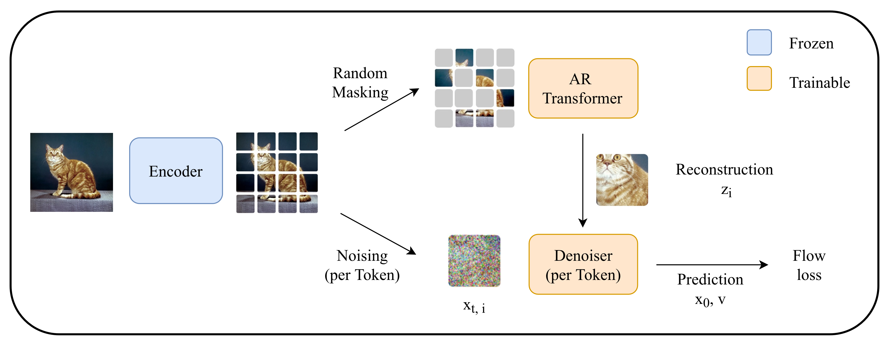
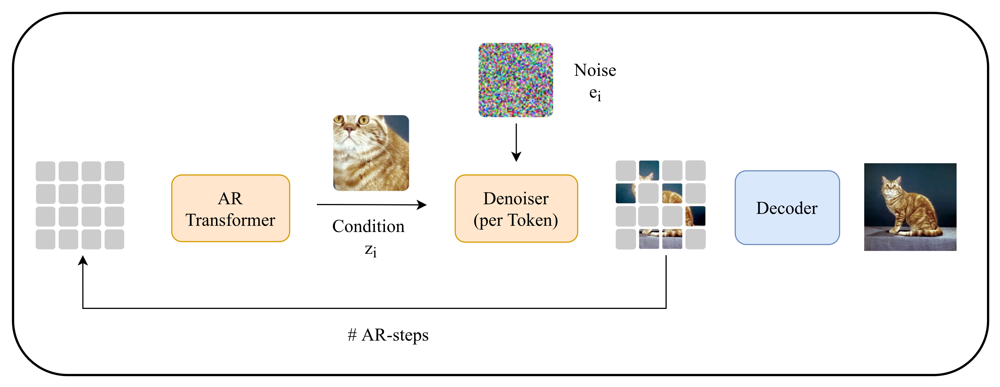

# FlowMAR - Masked Autoregression with Per-Token Rectified Flow
FlowMAR is a class-conditional image generation framework that combines masked autoregressive generation with a per-token rectified flow loss. It supports multiple target spaces, enabling training in VAE latent space, semantic representation spaces (DINOv2, MAE) and pixel space.

## General Pipeline

### Training pipeline



### Inference pipeline


## Explored Representation Space
 | Tokenizer | Description |
|---|---|
| **SD-VAE (KL-16)** | Stable Diffusion KL-regularized VAE |
| **RAE + DINOv2-B** | Semantic DINOv2-B features decoded by RAE |
| **RAE + MAE-B** | MAE-B features decoded by RAE |
| **Pixel Space** | No tokenizer; patches operated on directly |

 ## Dataset
 We trained on the [ImageNet-1k](https://image-net.org/download) dataset with conditional class-to-image generation. 

 ## Installation
```bash
pip install -r requirements.txt
```
The FID evaluation depends on a customized [torch-fidelity](https://github.com/LTH14/torch-fidelity) fork, which is installed automatically via the requirements file.

## Training
All experiments use 4× H100 GPUs, batch size 512 (128 per GPU), 200 epochs. 

You just have to change the ImageNet path: "--data_path ./ImageNet2012"

### SD-VAE baseline
```bash
torchrun \
--nproc_per_node=4 --nnodes=1 --node_rank=0 \
flow_mar/src/main.py \
--config ./configs/ImageNet256/base/flowMAR_B_vae_final.yaml \
--use_logging \
--batch_size 128 \
--epochs 200 \
--lr 2e-4 \
--warmup_epochs 50 \
--gen_batch_size 128 \
--num_images 50000 \
--online_eval_freq 20 \
--save_freq 5 \
--data_path ./ImageNet2012 \
--fid_statistics \
--fid_statistics_path ./fid_stats/adm_in256_stats_full.npz \
--cfg_scale 6.0 \
--denoiser_type ada_ln \
--use_wandb 
```

### DINOv2 representation space from [RAE](https://github.com/bytetriper/RAE)
```bash
torchrun \
--nproc_per_node=4 --nnodes=1 --node_rank=0 \
flow_mar/src/main.py \
--config ./configs/ImageNet256/base/flowMAR_B_dinov2_final.yaml \
--use_logging \
--batch_size 128 \
--epochs 200 \
--lr 2e-4 \
--warmup_epochs 50 \
--gen_batch_size 128 \
--num_images 50000 \
--online_eval_freq 20 \
--save_freq 5 \
--data_path ./ImageNet2012 \
--fid_statistics \
--fid_statistics_path ./fid_stats/adm_in256_stats_full.npz \
--cfg_scale 1.0 \
--denoiser_type ada_ln_fusion \
--use_wandb 
```

### Pixel space
```bash
torchrun \
--nproc_per_node=4 --nnodes=1 --node_rank=0 \
flow_mar/src/main.py \
--config ./configs/ImageNet256/base/flowMAR_B_pixel_final.yaml \
--use_logging \
--batch_size 128 \
--epochs 200 \
--lr 2e-4 \
--warmup_epochs 50 \
--gen_batch_size 128 \
--num_images 50000 \
--online_eval_freq 20 \
--save_freq 5 \
--data_path ./ImageNet2012 \
--fid_statistics \
--fid_statistics_path ./fid_stats/adm_in256_stats_full.npz \
--cfg_scale 2.0 \
--denoiser_type ada_ln_fusion \
--use_wandb 
```


## Evaluation
To evaluate a saved checkpoint:

```bash
torchrun \
--nproc_per_node=1 --nnodes=1 --node_rank=0 \
flow_mar/src/main.py \
--config ./configs/ImageNet256/base/flowMAR_B_dinov2_final.yaml \
--use_logging \
--gen_batch_size 128 \
--num_images 50000 \
--data_path ./ImageNet2012 \
--fid_statistics \
--fid_statistics_path ./fid_stats/adm_in256_stats_full.npz \
--cfg_scale 1.0 \
--denoiser_type ada_ln_fusion \
--load_check \
--checkpoint_path .checkpoints/flowMAR_B_dinov2_final/checkpoint_epoch200.pt \
--evaluate
```

For evaluation we used the customized [torch-fidelity](https://github.com/LTH14/torch-fidelity) codebase to evaluate the FID and IS against a reference statitics. We used the pre-computed stats from [JiT](https://github.com/LTH14/JiT). You can also prepare your own reference image folder for evaluation. 
